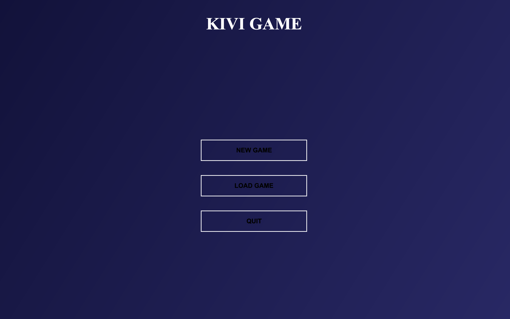
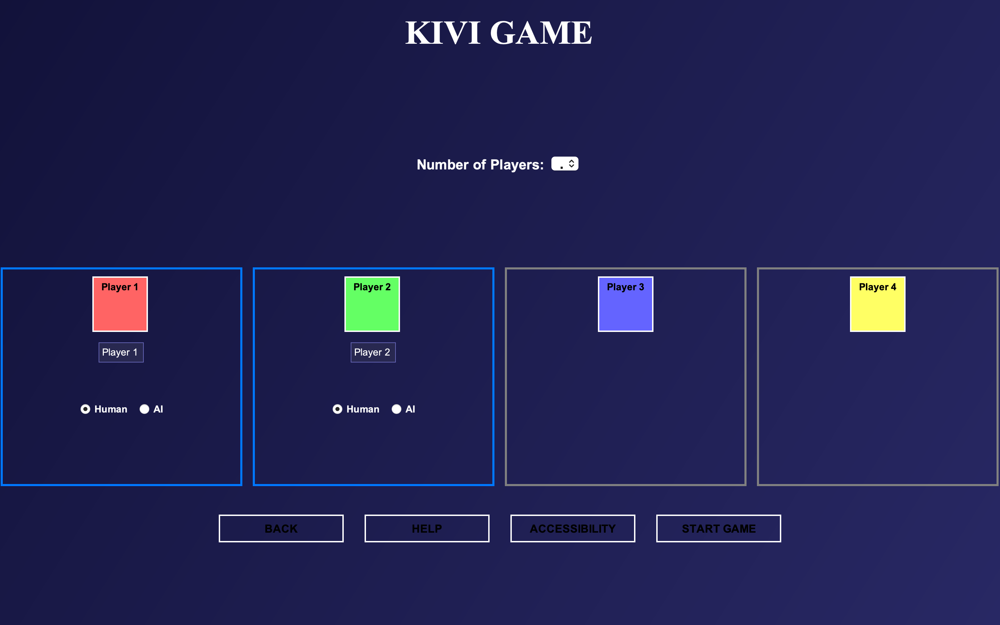
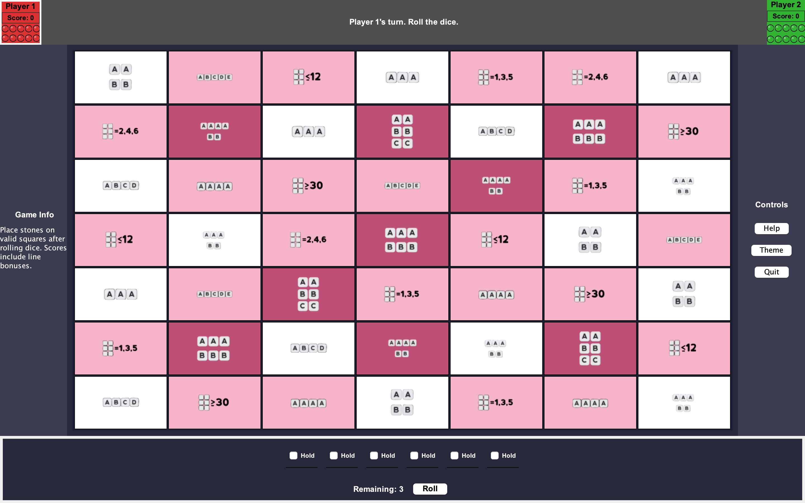

# 🎮 Kivi Game – Java Swing Board Game (GROUP PROJECT)

Kivi Game is a turn-based 2D board game built in Java using Swing. Created as a group project for COMP 2005, it includes AI vs Human mode, color-blind accessibility, and intuitive gameplay mechanics.

## 🧠 Features

- 👤 AI vs Human gameplay logic
- 🎨 Accessibility for color-blind users
- 🪄 Interactive board rendering with Java Swing
- 👥 Developed as a team project for COMP 2005

## 🖼️ Screenshots






## 🛠️ Tech Stack

- Java
- Java Swing
- OOP (Object-Oriented Programming)

## 📦 How to Run

```bash
javac -d bin src/*.java
java -cp bin Main
```

>  You may need to adjust the classpath based on your file structure.

## 👥 Team

- Saad Bin Dawlat  
- Doyun Chin (Max)  
- Hassan Rana  
- Sujoy Chowdhury  
- A. Stricklan  


